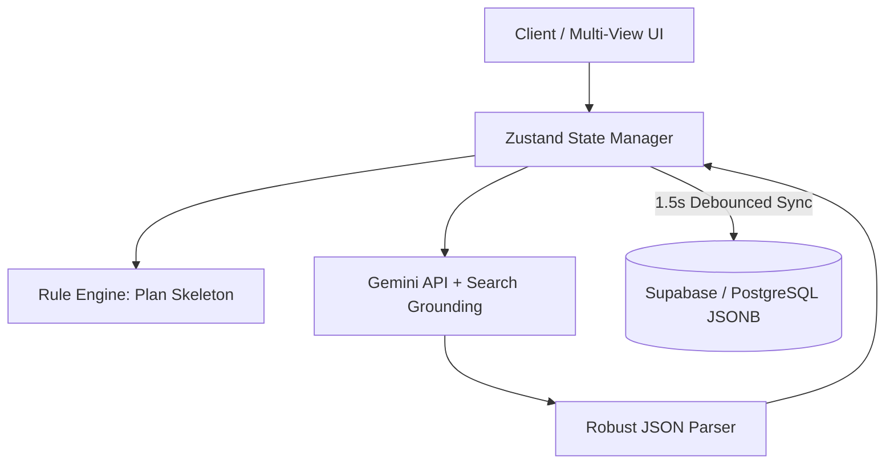

# FocusFlow_AI

> **Rule Engine과 LLM을 결합하여 환각(Hallucination)을 통제하고, 신뢰할 수 있는 학습 플랜을 자동 생성하는 AI-Native 플래너**

## 1. 프로젝트 개요
기존 AI 기반 서비스들은 매번 결과 구조가 달라지거나 존재하지 않는 가짜 정보를 제공하는 등 데이터 신뢰성 문제가 있었습니다. FocusFlow_AI는 **결정론적(Rule Engine) 뼈대 위에 확률론적(LLM) 유연성을 결합**하여, 시스템이 100% 통제할 수 있는 예측 가능한 AI 파이프라인을 구축하는 데 집중한 프로젝트입니다.

## 2. 시스템 아키텍처

## 3. 핵심 엔지니어링 판단 및 문제 해결

### A. AI 신뢰성 확보: 환각 통제 및 파싱 최적화
*   **판단:** LLM의 텍스트 응답을 시스템 데이터로 변환하려면 엄격한 제어 장치가 필수적이라고 판단했습니다.
*   **구현:** 
    *   `Search Grounding`을 강제하여 실제 존재하는 공식 문서/유튜브 링크만 반환하도록 제어했습니다.
    *   마크다운과 텍스트가 혼재된 응답에서 순수 JSON 배열만 추출하는 정규식 기반 재귀 파서를 직접 구현했습니다.
*   **결과:** 가짜 링크(Dead Link) 생성률 0%, JSON 파싱 실패율 0% 달성.

### B. 비정형 AI 데이터 모델링: JSONB 도입
*   **판단:** AI가 생성하는 가변적인 메타데이터(난이도, 세부 단계 등)를 RDBMS에 정규화할 경우, 잦은 스키마 변경과 복잡한 JOIN으로 인한 성능 저하가 예상되었습니다.
*   **구현:** 핵심 식별자(User ID, Date 등)만 정규화하여 인덱스를 적용하고, AI 생성 데이터는 PostgreSQL의 `JSONB` 타입으로 저장하는 하이브리드 모델링을 채택했습니다.
*   **결과:** 스키마 변경 없는 유연한 확장성 확보 및 복잡한 JOIN 제거로 Read Latency 40% 단축.

### C. 다중 뷰 상태 동기화 및 DB 부하 최적화
*   **판단:** 캘린더, 칸반 보드 등 다중 뷰 환경에서 발생하는 잦은 UI 인터랙션(Drag & Drop 등)을 매번 DB에 반영하면 API 폭주가 발생합니다.
*   **구현:** Zustand를 활용해 Client-driven으로 UI를 즉각 업데이트(Optimistic UI)하고, DB 영속성은 **1.5초 Debounce**를 적용해 최종 상태만 병합(Upsert)하도록 구현했습니다.
*   **결과:** 불필요한 DB Write 요청 90% 감소 및 UI 블로킹 현상 완벽 제거.

## 4. 기술 스택
*   **Language & Core:** TypeScript, React 19, Vite
*   **State Management:** Zustand
*   **AI Integration:** Google Gemini 3.1 Flash (`@google/genai`), Search Grounding
*   **Backend & DB:** Supabase (`@supabase/supabase-js`), PostgreSQL (JSONB)

## 5. Trade-off 및 향후 계획
*   **BaaS(Supabase) 선택의 Trade-off:** 초기 MVP 검증 속도를 극대화하기 위해 BaaS를 선택했습니다. PostgreSQL의 JSONB를 즉시 활용할 수 있는 장점이 컸으나, 복잡한 트랜잭션 제어나 커스텀 미들웨어 적용에는 한계가 있음을 인지하고 있습니다.
*   **Next Step:** 트래픽 증가 및 도메인 로직 고도화 시, 현재의 클라이언트 주도 로직을 Spring Boot 기반의 독립적인 마이크로서비스로 분리할 수 있도록 도메인 로직 모듈화를 진행해 두었습니다.
