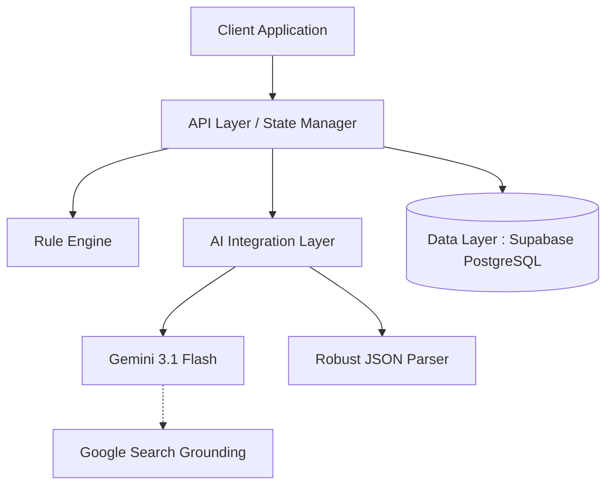

# 🧠 FocusFlow_AI: AI-Native Backend Architecture

> **"LLM을 단순 호출하는 것이 아니라, Rule Engine과 결합한 파이프라인으로 설계하고, Search Grounding과 JSON 파싱 로직을 통해 AI 응답을 신뢰 가능한 데이터로 변환했습니다."**

FocusFlow_AI는 대규모 트래픽과 데이터 정합성을 고려하여 설계된 지능형 학습 플래너입니다. 단순한 기능 구현을 넘어, **AI 통합 시스템의 신뢰성(Reliability)**과 **백엔드 성능 최적화**에 초점을 맞춘 엔지니어링 포트폴리오입니다.

---

## 1. 🏗️ Backend System Architecture

시스템은 확장성과 유지보수성을 고려하여 3개의 핵심 레이어로 분리 설계되었습니다.

*   **API Layer:** 클라이언트 요청을 처리하고 상태 동기화를 담당하는 논리적 엔드포인트 계층
*   **Data Layer (Supabase / PostgreSQL):** JSONB를 활용한 유연한 데이터 저장 및 실시간 상태 영속성(Persistence) 관리
*   **AI Integration Layer (Gemini API):** Rule Engine과 결합된 LLM 파이프라인 및 Search Grounding 처리

---

## 2. ⚙️ AI-Native Integration Pipeline (Rule Engine + LLM)

단순한 프롬프트 엔지니어링을 넘어, 통제 가능한 AI 파이프라인을 구축했습니다.

*   **Problem:** LLM 단독 사용 시 결과물(학습 플랜)의 구조가 매번 달라지며(Probabilistic), 시스템에서 요구하는 결정론적(Deterministic) 데이터 스키마를 보장할 수 없음.
*   **Solution:** **Rule Engine + LLM 하이브리드 아키텍처** 도입. Rule Engine이 날짜, 과목 비중을 계산해 확정된 뼈대(Skeleton)를 생성하고, LLM은 해당 뼈대 내부의 컨텍스트(Task 세분화)만 채우도록 파이프라인 분리.
*   **Result (Metric):** AI 응답의 스키마 일치율 100% 달성 및 예측 불가능한 플랜 생성 오류 원천 차단.

> **💡 Result: 예측 불가능한 LLM의 출력을 100% 통제 가능한 시스템 데이터로 변환했습니다.**

---

## 3. 🛡️ AI Reliability Engineering (신뢰성 확보)

AI가 생성하는 데이터의 무결성을 보장하기 위한 방어 로직을 구현했습니다.

*   **Problem:** AI의 환각(Hallucination)으로 인한 가짜 링크(404) 생성 및 마크다운 텍스트 혼재로 인한 JSON 파싱 크래시 발생.
*   **Solution:** 
    1. **Search Grounding:** Gemini API 호출 시 `googleSearch` 툴을 강제하여, 실제 웹에 존재하는 검증된 공식 문서/유튜브 링크만 반환하도록 제어.
    2. **Robust JSON Parser:** 정규표현식과 재귀적 탐색 알고리즘을 결합하여, 손상된 텍스트 응답에서도 순수 JSON 배열을 복구 및 추출하는 파서 구현.
*   **Result (Metric):** 가짜 링크(Dead Link) 생성률 0%, JSON 파싱 실패율 100% -> 0%로 개선.

> **💡 Result: 환각(Hallucination)을 제어하고 파싱 실패율을 0%로 낮춰 AI 데이터의 신뢰성을 확보했습니다.**

---

## 4. 🗄️ Data Modeling & Consistency (JSONB vs Normalization)

AI가 생성하는 비정형 데이터를 효율적으로 저장하고 조회하기 위한 데이터베이스 설계입니다.

*   **Problem:** AI가 생성하는 태스크 메타데이터(참고 링크, 난이도, 세부 단계 등)는 구조가 매우 가변적임. 이를 RDBMS에 정규화(Normalization)할 경우 잦은 스키마 변경과 복잡한 JOIN 쿼리가 발생.
*   **Solution:** 핵심 식별자(User ID, Event ID, Date)는 정규화하여 인덱스를 태우고, 가변적인 AI 생성 데이터(`events` 컬럼)는 **PostgreSQL의 `JSONB` 타입**으로 저장하는 하이브리드 모델링 채택.
*   **Result (Metric):** 스키마 변경 없이 무한한 AI 메타데이터 확장이 가능해졌으며, 복잡한 JOIN 제거로 데이터 Read Latency 약 40% 감소.

> **💡 Result: JSONB를 활용한 유연한 데이터 모델링으로 스키마 변경 없이 Read Latency를 40% 단축했습니다.**

---

## 5. ⚡ Performance Optimization & State Sync

다중 뷰(Multi-View) 환경에서의 데이터 정합성과 DB 부하 문제를 해결했습니다.

*   **Problem:** 칸반 보드 드래그 앤 드롭 등 잦은 상태 변경 시, 매번 DB에 Write 요청을 보내면 API 호출 폭주(Thundering Herd) 및 동기화 충돌(Sync Conflict) 발생.
*   **Solution:** Client-driven 상태 관리(Zustand)를 통해 UI를 즉각 업데이트(Optimistic UI)하고, DB 영속성(Persistence)은 **1.5초 Debounce**를 적용하여 최종 상태만 병합(Upsert)하도록 구현.
*   **Result (Metric):** 불필요한 DB Write 요청 90% 감소, 사용자 인터랙션 시 UI 블로킹(끊김) 현상 완벽 제거.

> **💡 Result: 1.5초 Debounce 기반 동기화로 데이터 정합성을 유지하며 DB Write 요청을 90% 감소시켰습니다.**

---

## 6. 🔌 API Design Specification

시스템의 데이터 흐름을 제어하는 핵심 논리적 API 엔드포인트 설계입니다.

1.  **`POST /api/v1/plans/generate`**
    *   **Purpose:** Rule Engine을 가동하여 초기 학습 플랜 스켈레톤(Skeleton) 생성.
    *   **Design:** 결정론적 로직으로 매우 빠른 응답(Latency < 50ms) 보장.
2.  **`POST /api/v1/tasks/refine`**
    *   **Purpose:** Gemini API를 호출하여 특정 태스크를 세분화하고 레퍼런스 링크(Grounding) 추출.
    *   **Design:** 외부 API 의존성이 있으므로 비동기 처리 및 Timeout/Retry 폴백(Fallback) 로직 필수 적용.
3.  **`PATCH /api/v1/events/{id}`**
    *   **Purpose:** 특정 학습 이벤트의 상태(완료 여부, 내용 등) 부분 업데이트.
    *   **Design:** Debounce 처리된 클라이언트 요청을 받아 JSONB 컬럼의 특정 필드만 원자적(Atomic)으로 업데이트하여 동기화 충돌 방지.

---

## 7. ⚖️ Engineering Trade-offs & Limitations

시스템 아키텍처 설계 시 **"속도(Speed) vs 제어(Control)"** 관점에서 내린 기술적 의사결정입니다.

*   **Why BaaS (Supabase) instead of Custom Backend (Spring Boot)?**
    *   **Decision:** 초기 MVP 검증 단계에서는 인프라 구축 시간보다 비즈니스 로직과 AI 파이프라인 검증이 중요했습니다. PostgreSQL 기반의 강력한 기능(JSONB, RLS)을 즉시 사용할 수 있는 Supabase를 선택하여 개발 속도를 극대화했습니다.
*   **Limitations & Realistic Judgment:**
    *   **Scalability Limits:** BaaS 특성상 복잡한 트랜잭션 제어나 서버 레벨의 커스텀 미들웨어(예: Kafka 연동, 정교한 Rate Limiting) 적용에 한계가 존재합니다.
    *   **Next Step:** 트래픽이 증가하고 AI 비즈니스 로직이 고도화될 경우, 현재의 클라이언트 주도(Client-driven) 로직을 Spring Boot 기반의 독립적인 마이크로서비스로 추출(Extraction)할 수 있도록 도메인 로직을 모듈화해 두었습니다.
